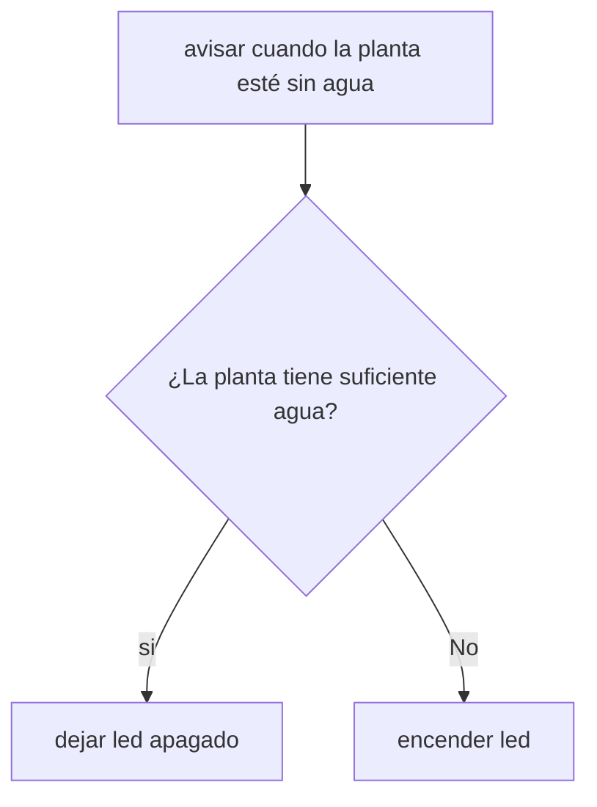

# sensor_humedad
sensor de humedad hecho por Abrigo, Ramallo y Ruarte (las mejores del mundo obviamente)

# Problemática
## Monitoreo y Riego/Alerta de Humedad y Temperatura para Plantas de Interior
**Descripción del problema:** Muchas veces las plantas de interior sufren porque nos olvidamos de regarlas o porque la temperatura del ambiente no es la adecuada, lo que seca la tierra o daña el cultivo.

*Solución propuesta:* Un sistema basado en Arduino que mida la humedad del suelo y/o la temperatura ambiente, alertando visualmente (con LEDs) o mediante una pequeña pantalla/zumbador cuando la planta necesita atención.

### Componentes Necesarios
* Arduino Uno (o una placa compatible).
* Sensor de Temperatura y Humedad DHT11.
* Sensor de Humedad de Suelo (potenciómetro en simulación).
* 2 LEDs (rojo para "alerta/necesita agua").
* Resistencias de 220 ohms para los LEDs.

### Requerimientos Funcionales Básicos
* El sistema debe leer de forma continua la temperatura ambiente y la humedad de la tierra.
* Si la humedad de la tierra está por debajo de un umbral seguro, se encenderá el LED rojo y sonará una alerta suave en el buzzer.
* Si los valores son correctos, el Led permanecerá apagado indicando que todo está en orden.

### Requerimientos No Funcionales
* *Disponibilidad:* El sistema debe operar de manera continua (24/7) estando conectado a una fuente de alimentación USB estable, permitiendo un monitoreo ininterrumpido de la planta.
* *Usabilidad:* Las alertas visuales (LEDs) deben ser claras y distinguibles a simple vista (por ejemplo: verde para estado normal y rojo para advertencia), facilitando la interpretación rápida del usuario sin necesidad de conocimientos técnicos.
* *Rendimiento y Tiempo de Respuesta:* El tiempo de lectura de los sensores y la actualización de los actuadores (LEDs y buzzer) no debe superar los 2 segundos por ciclo para garantizar una respuesta rápida ante cambios ambientales.
* *Costo y Portabilidad:* El hardware seleccionado debe ser de bajo costo comercial y de dimensiones reducidas, permitiendo que el circuito físico final sea fácil de trasladar e instalar en una maceta o espacio reducido.

## Historia de Usuario
*Título:* Alerta temprana por sequía en planta de interior.
*Como:* Amante de las plantas de interior que suele olvidarse de regarlas a tiempo.
*Quiero:* Que el sistema emita una alerta visual y sonora cuando la humedad del suelo baje de un nivel crítico.
*Para que:* Pueda identificar rápidamente cuándo la planta necesita agua y evitar que se seque o muera.

